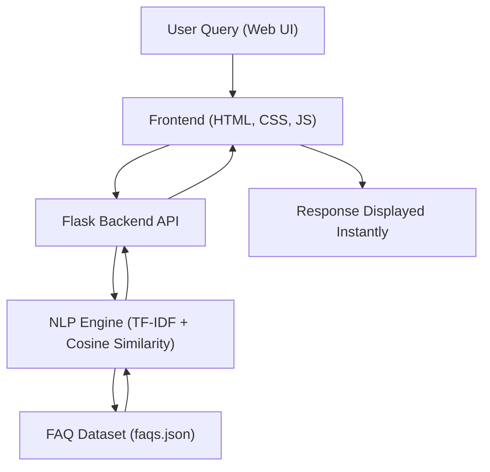
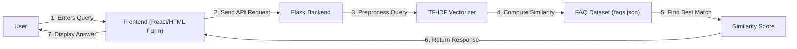
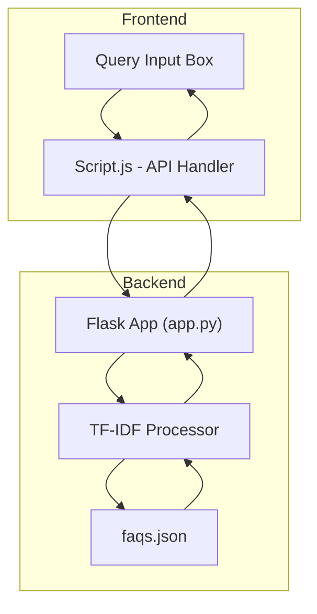

# MediQuery | THe Smart FAQ Health Assistant

**MediQuery** is an intelligent FAQ query-response system built using **Python** and **Flask**, enhanced by **NLP (TF-IDF + Cosine Similarity)** to understand user questions and return the most relevant answers.


---

## Overview

Healthcare websites and online services often have large FAQ sections — but users struggle to find quick answers.
**MediQuery** solves this by enabling users to **type natural language queries** and instantly retrieving the most relevant FAQ using **semantic similarity** rather than keyword matching.

---

## Tech Stack

| Layer          | Technology                               |
| :------------- | :--------------------------------------- |
| **Language**   | Python                                   |
| **Framework**  | Flask                                    |
| **NLP Engine** | scikit-learn (TF-IDF, Cosine Similarity) |
| **Frontend**   | HTML, CSS, JavaScript                    |
| **Deployment** | Vercel                                   |

---

## Key Features

- **Intelligent FAQ Matching** — understands user intent via TF-IDF vectorization
- **Lightweight Flask Backend** — fast and scalable for production use
- **JSON-based Knowledge Base** — FAQs are stored in a structured, editable format
- **Responsive Frontend** — smooth and minimal UI built with vanilla HTML/CSS/JS
- **Instant Search Results** — retrieves answers in under a second

---

## System Architecture Diagram



**Explanation:**
The user query travels from the frontend to Flask, where it’s vectorized and compared with stored FAQs.
The system then ranks results by cosine similarity and sends the top match back to the user.

---

## Data Flow Diagram



**Flow Summary:**
- User asks a question →
- Flask processes it using TF-IDF →
- Similarity scores identify the most relevant FAQ →
- Result sent back and shown instantly.

---

## Component Interaction Diagram



This shows how frontend scripts, Flask routes, and the NLP engine communicate seamlessly to answer questions.

---

## Project Structure

```plaintext
MediQuery/
│── app.py                # Flask server and main logic
│── faqs.json             # FAQ dataset
│── templates/            # HTML templates
│── static/               # CSS, JS, assets
│── requirements.txt      # Dependencies
│── vercel.json           # Vercel deployment config
│── README.md             # Documentation
```

---

## Installation

### Prerequisites

* Python 3.8+
* pip

### Setup Steps

```bash
git clone https://github.com/Kritvi0208/MediQuery.git
cd MediQuery
pip install -r requirements.txt
python app.py
```

Then open `http://127.0.0.1:5000` in your browser.

---

## Example Interaction

| User Query                            | Matched FAQ                                                           | Confidence |
| ------------------------------------- | --------------------------------------------------------------------- | ---------- |
| *“How can I book an appointment?”*    | “To book an appointment, click the Book Now button on the home page.” | 0.94       |
| *“What are the clinic’s hours?”*      | “Our clinic is open from 9 AM to 8 PM on weekdays.”                   | 0.91       |
| *“Is online consultation available?”* | “Yes, we offer online consultations via our patient portal.”          | 0.88       |

---

## Future Enhancements

* Add **contextual embeddings** using **Sentence Transformers**
* Build a **feedback system** to learn from user ratings
* Convert to **REST API** for integration with other healthcare systems
* Deploy a **React-based frontend** for richer UI
